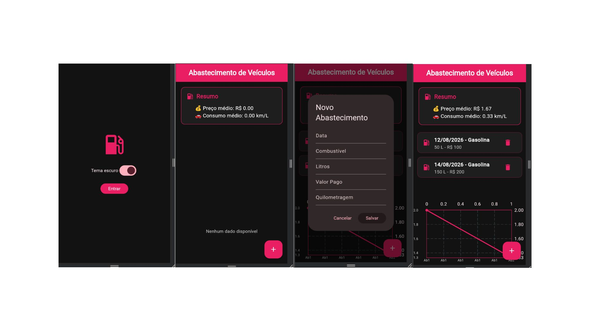

# ⛽ Abastecimento de Veículos

Aplicativo desenvolvido em Flutter para registrar e acompanhar abastecimentos de veículos.

## 🎯 Objetivo

Registrar:

- Data
- Combustível
- Litros
- Valor pago
- Quilometragem

E calcular:

- 💰 Preço médio por litro
- 🚗 Consumo médio em km/L

## ✨ Funcionalidades

- Cadastro de abastecimentos
- Edição de registros
- Exclusão de registros
- Histórico de abastecimentos
- Cálculo de preço médio
- Cálculo de consumo médio
- Gráfico comparativo
- Salvamento local dos dados
- Tema claro e escuro
- Interface com detalhes em rosa

## 🛠️ Tecnologias

- Flutter
- Dart
- SharedPreferences
- FL Chart
- JSON

## ▶️ Como executar

```bash
flutter pub get
flutter run
<<<<<<< HEAD

```
## 📸 IMAGEM DO APLICATIVO


=======
>>>>>>> 8135ed4ab41731ea01fd3d695e658f9c212d7c5f
