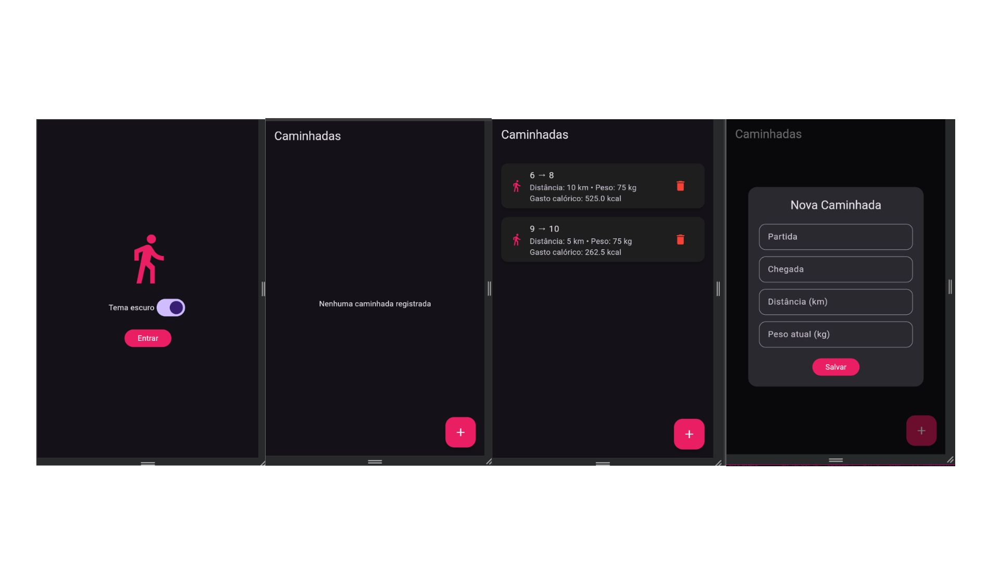

# 🚶 CAMINHADAS X CALORIAS
<<<<<<< HEAD

Aplicativo desenvolvido em Flutter para registrar caminhadas e calcular o gasto calórico.

## 🎯 OBJETIVO

Registrar:

- Partida
- Chegada
- Distância em km
- Peso atual em kg

O gasto calórico é calculado pela fórmula:

Calorias = 0,7 × peso × distância

## ✨ FUNCIONALIDADES

- Cadastro de caminhadas
- Histórico de caminhadas
- Exclusão de registros
- Edição de registros
- Cálculo de calorias gastas
- Salvamento local dos dados
- Tema claro e escuro
- Tela Splash
- Gráfico comparativo
- Interface personalizada

## 🛠️ TECNOLOGIAS

- Flutter
- Dart
- SharedPreferences
- JSON
- Material Design

## ▶️ COMO EXECUTAR

flutter pub get
flutter run

## 📸 IMAGEM DO APLICATIVO

=======

Aplicativo desenvolvido em Flutter para registrar caminhadas e calcular o gasto calórico.

## 🎯 OBJETIVO

Registrar:

- Partida
- Chegada
- Distância em km
- Peso atual em kg

O gasto calórico é calculado pela fórmula:

Calorias = 0,7 × peso × distância

## ✨ FUNCIONALIDADES

- Cadastro de caminhadas
- Histórico de caminhadas
- Exclusão de registros
- Edição de registros
- Cálculo de calorias gastas
- Salvamento local dos dados
- Tema claro e escuro
- Tela Splash
- Gráfico comparativo
- Interface personalizada

## 🛠️ TECNOLOGIAS

- Flutter
- Dart
- SharedPreferences
- JSON
- Material Design

## ▶️ COMO EXECUTAR

flutter pub get
flutter run

>>>>>>> 8135ed4ab41731ea01fd3d695e658f9c212d7c5f
