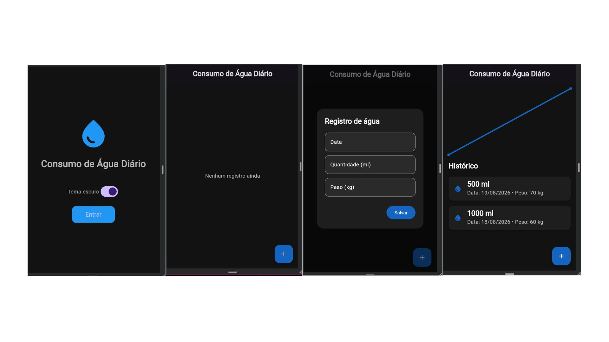

# 💧 CONSUMO DE ÁGUA

Aplicativo desenvolvido em Flutter para registrar e acompanhar o consumo diário de água.

## 🎯 OBJETIVO

Registrar:

- Data
- Quantidade de água em ml
- Peso atual em kg

A meta diária é calculada considerando:

Meta diária = 35 × peso

A porcentagem da meta atingida é calculada com:

Porcentagem = (quantidade consumida ÷ meta diária) × 100

## ✨ FUNCIONALIDADES

- Cadastro de consumo de água
- Histórico em cartões
- Exclusão de registros
- Edição de registros
- Cálculo da meta diária
- Cálculo da porcentagem da meta atingida
- Exibição do total consumido no dia
- Salvamento local dos dados
- Tema claro e escuro
- Tela Splash
- Gráfico de consumo de água
- Interface personalizada

## 🛠️ TECNOLOGIAS

- Flutter
- Dart
- SharedPreferences
- FL Chart
- JSON
- Material Design

## ▶️ COMO EXECUTAR

flutter pub get
flutter run
<<<<<<< HEAD

## 📸 IMAGEM DO APLICATIVO

=======
>>>>>>> 8135ed4ab41731ea01fd3d695e658f9c212d7c5f
